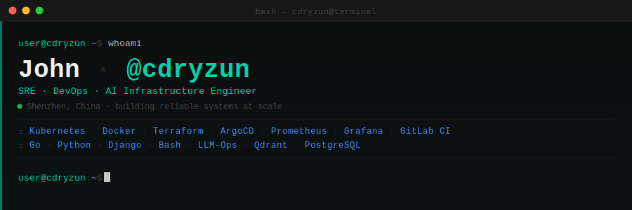

<div align="center">
  
</div>

<br/>

<div align="center">

[](https://github.com/cdryzun)&nbsp;
[](https://github.com/cdryzun?tab=followers)&nbsp;
[](https://github.com/cdryzun?tab=repositories)

</div>

---

```text
$ ls -la ./skills
```

<table>
<tr>
<td valign="top" width="50%">

```text
drwxr-xr-x  infrastructure/
  ├── kubernetes      [expert]
  ├── docker          [expert]
  ├── helm            [advanced]
  ├── argocd          [advanced]
  ├── terraform       [advanced]
  ├── ansible         [advanced]
  ├── gitlab-ci       [expert]
  └── jenkins         [advanced]

drwxr-xr-x  observability/
  ├── prometheus      [expert]
  ├── grafana         [advanced]
  ├── victoriametrics [advanced]
  ├── elasticsearch   [advanced]
  └── nginx           [expert]
```

</td>
<td valign="top" width="50%">

```text
drwxr-xr-x  ai-infrastructure/
  ├── django          [expert]
  ├── python          [expert]
  ├── llm-ops         [advanced]
  ├── rag-pipeline    [advanced]
  ├── qdrant          [advanced]
  └── dify            [advanced]

drwxr-xr-x  languages/
  ├── go              [advanced]
  ├── python          [expert]
  ├── bash            [expert]
  ├── typescript      [intermediate]
  └── rust            [learning]
```

</td>
</tr>
</table>

---

```text
$ cat /proc/github_stats
```

<div align="center">
  
  &nbsp;
  
</div>

<br/>

<div align="center">
  
</div>

---

```text
$ git log --oneline --stat ./projects
```

<table>
<tr>
<td width="50%">
<a href="https://github.com/cdryzun/inotify-watcher">
  
</a>
</td>
<td width="50%">
<a href="https://github.com/cdryzun/gitlab-ci-templates">
  
</a>
</td>
</tr>
<tr>
<td width="50%">
<a href="https://github.com/cdryzun/trackers">
  
</a>
</td>
<td width="50%">
<a href="https://github.com/cdryzun/Cloudflare-edge-accelerator">
  
</a>
</td>
</tr>
</table>

---

```text
$ history | tail -n 6
  996  kubectl rollout status deploy/ai-gateway -n prod
  997  terraform apply -target=module.postgres_ha --auto-approve
  998  dify upgrade --channel stable && kubectl rollout restart deploy/dify
  999  promtool check rules /etc/prometheus/rules/*.yml
 1000  go build -ldflags="-s -w" -o bin/inotify-watcher ./cmd/...
 1001  git push origin main
```

---

<div align="center">
  
</div>
