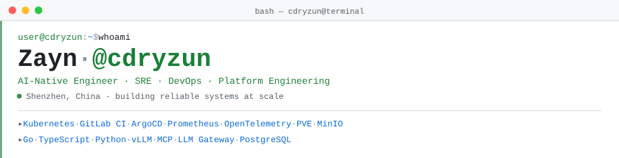

  

## What I build

I build AI-native developer platforms that connect private model serving, secure API gateways, MCP tools, Kubernetes delivery, and production observability.

I am a CKA/CKS-certified engineer with seven years of experience turning infrastructure, delivery, and AI tooling into reliable internal platforms.

- **AI infrastructure** — self-hosted model access, provider-compatible gateways, quota and audit controls, and MCP integrations.
- **Platform engineering** — Kubernetes, GitLab CI/CD, GitOps, reusable delivery templates, and developer self-service.
- **Reliability engineering** — observability, backup, network, security, and operational automation.

## Impact

- Built a Kubernetes Scheduler Extender and GitLab Runner workspace reuse system that made builds up to **7x faster** and reduced CI storage from approximately **2 TB to 400 GB**.
- Built private LLM infrastructure and authenticated API/MCP workflows handling **3,500+ daily calls** for **20+ engineers**.
- Standardized reusable delivery platforms and engineering practices supporting **50+ engineers**.

## Selected work

- [`llm-relay-gateway`](https://github.com/cdryzun/llm-relay-gateway) — self-hosted LLM relay gateway for private routing, provider compatibility, quotas, and audit controls.
- [`gitlab-ci-templates`](https://github.com/cdryzun/gitlab-ci-templates) — reusable multi-language CI/CD templates with Docker, SonarQube, GitOps, and secret scanning.
- [`argocd-plugins`](https://github.com/cdryzun/argocd-plugins) — production-ready Argo CD CMP v2 plugin and Helm base for platform teams.
- [`inotify-watcher`](https://github.com/cdryzun/inotify-watcher) — Go-based Linux filesystem watcher with write-completion detection and intelligent debouncing.

## Core stack

`Go` · `TypeScript` · `Python` · `Kubernetes` · `GitLab CI/CD` · `Argo CD` · `OpenTelemetry` · `Prometheus` · `vLLM` · `MCP` · `PostgreSQL`

## Elsewhere

[Blog](https://www.treesir.pub) · [Resume](https://resume.treesir.pub/)

  

